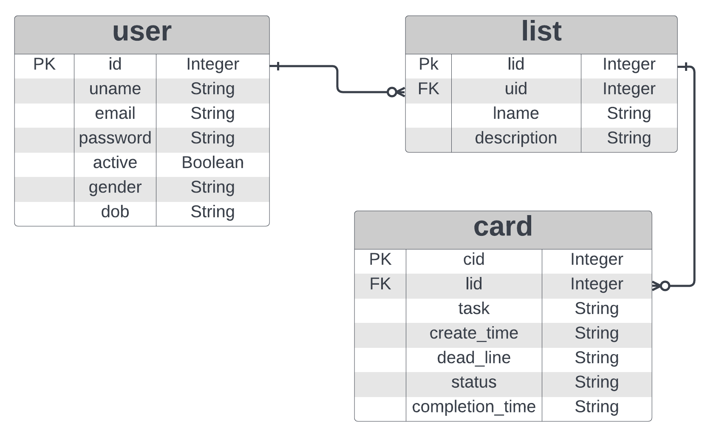

# KANBAN WEB APP

Academic Project


## Description

The aim of the project is to build a Kanban app, in which user is able to add & track tasks of their choice. The goal is to reduce the load on server by doing rendering of UI & UX on the client frontend. Meanwhile server should be able to do scheduled jobs or other jobs like sending user triggered emails, caching etc.


## Technologies used

•	Jinja 2 – For html template rendering for sending emails and partially as frontend.
•	Flask – Flask framework is used for the app creation as it is simple and have most of the essential extensions inbuilt.
•	Flask-SQLAlchemy – Is used for modelling and querying of database.
•	Flask-Security – Is used for authentication of user and to provide a basic security of data.
•	VueJS – Is used as a JavaScript framework for building UI & UX. Inside vue.js used Vuex as the state mansgement library, Vue Router as router for making it a single page application. Also used Chart.js for generating charts.
•	Redis – A in-memory data structure store used as message broker for managing jobs queue and also for caching.
•	Celery – An asynchronous job queue for scheduling and executing jobs.
•	MailHog – A fake SMTP server for email-testing
•	Weasyprint – For generating pdfs


## DB Schema Design



This is the ER diagram of the database schema (The lines wont be visible if you are using a dark theme). Apart from all primary keys, email in user table is having a unique constrain. List table is a one-to-many relation table of user table. Card table is a one-to-many relationship table of list table. Each relation is having delete cascade option, so once a parent object is deleted all its children will be deleted.


## API Design

API elements are created for CRUD operations of individual User, List and Card. Apart from that API for getting all lists of the user, all cards in a list and for triggering an export job is also created. The yamil file is present in ‘Open API yaml’ folder along with the project code.

## Architecture and Features

The entire project is organised as a proper full stack structure. All the HTML files are stored inside ‘templates’ folder. The Python codes are separated according to their purposes and are stored inside corresponding folders inside ‘application’ folder. The SQlite database file is stored inside ‘db_directory’ folder. The external packages need to be installed are listed in the ‘requirements.txt’ file. The project can be executed buy running “local_setup.sh” file followed by “local_run.sh” file in a Linux based command prompt. Then for the scheduled jobs to execute:
1.	Start a Redis server (redis-server)
2.	Run “local_beat.sh”
3.	Run “local_workers.sh”
4.	Also, for viewing the email install and run a MailHog server

On running the app will be accessible only by registering and logging in. Once a user is logged in user will be taken to their home page. Where they can view all the lists (maximum five numbers) they currently have and the cards inside it. The cards are separated as completed and pending, and is sorted in order of deadline. There are options for viewing details of each card. User can edit or delete their account, add new list, edit or delete existing list, add new card to a list, edit or delete a card and can even move a card from one list to another. Following are the features available
*	UI with Vue & Vue Components
*	List & Card management using fetch API
*	Chart showing summary of task completion
*	Token based authentication for fetch API’s
*	Daily reminders to complete task via email
*	Able to send pdf monthly report as email
*	Able to send details as csv files on user request
*	Caching of data that don’t change frequently


# Local Development Run
> #### Run 'local_setup.sh' in a linux shell
> - This will create a virtual environment folder '.env' if not present already
> - Then it will activate the virtual environment and install all packages listed in "requirements.txt"
>
> #### Run 'local_run.sh'
> - This will activate the virtual environment
> - Then will run the 'main.py'
> - Now you can view the app in a web browser with the link [http://localhost:8080]
>
> #### Activate a redis server in another shell
> - use command **"redis-server"**
>
> #### Activate celery schedule in another shell by:
> - Run 'local_beat.sh'
>
> #### Activate celery worker in another shell by:
> - Run 'local_workers.sh'
>
> #### Install and activate MailHog to view the emails
> - MailHog will be available in this link [http://localhost:8025]
> - MailHog server can be astivated by **"~/go/bin/MailHog"** command
>
>> ### If not working
>> - If for some reasons it shows any error related to packages:- Please download the *.zip* or *.rar* file of original virtual environment setup used for the development of the project (Even though the package versions are specified in the *"requirements.txt"* file, changes in any sub-dependency package can cause error). Try repeating the process after making the downloaded file as the *"virtual environment"*.
>> - https://drive.google.com/drive/folders/1EJl4nIbMkClEVi8jqokRcq2qegfUMSAo?usp=sharing


# Folder Structure

- `application` is where our application code is
- `CSVFiles` is where the latest csv files created are stored
- `db_directory` has the sqlite DB. It can be anywhere on the machine. Adjust the path in ``application/config.py`. Repo ships with one required for testing.
- `Open API yaml` has the yaml file of Open API specification is stored
- `CdfFiles` is where the latest pdf monthly reports created are stored
- `static` is where JS and CSS files are stored
- `templates` - Default flask templates folder


```
├── application
│   ├── controller
│   │   ├── __init__.py
│   │   ├── api.py
│   │   └── controllers.py
│   ├── data
│   │   ├── __init__.py
│   │   ├── data_access.py
│   │   ├── database.py
│   │   └── models.py
│   ├── jobs
│   │   ├── __init__.py
│   │   ├── send_email.py
│   │   ├── tasks.py
│   │   └── workers.py
│   ├── utils
│   │   ├── __init__.py
│   │   └── validation.py
│   ├── __init__.py
│   └── config.py
├── CSVFiles
├── db_directory
│   └── testdb.sqlite3
├── Open API yaml
│   └── openapi.yaml
├── PdfFiles
├── static
│   ├── index.js
│   ├── sidebar.js
│   ├── style.css
│   └── tokenlogin.js
├── templates
│   ├── security   
│   │   ├── login_user.html
│   │   └── register_user.html
│   ├── 404.html    
│   ├── csvemail.html    
│   ├── home.html
│   ├── master.html
│   ├── remainderemail.html
│   ├── report.html
│   ├── sidebar.html
│   ├── tokenlogin.html
│   └── you.html
├── celerybeat-schedule
├── debug.log
├── dump.rdb
├── local_beat.sh
├── local_run.sh
├── local_setup.sh
├── local_workers.sh
├── main.py
├── Project_report.pdf
├── readme.md
└── requirements.txt

```